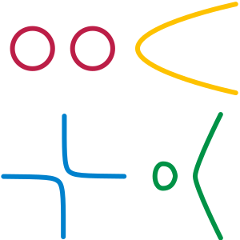

## Geometria differenziale

### Varietà

Una __varietà__ è una "superficie" generalizzata, vale a dire un'iper-superficie
di n dimensioni, che localmente è simile ad uno spazio euclideo della stessa
dimensione.

> __Esempi:__ Una retta, un cerchio o una parabola sono verietà
> a una dimensione, mentre un piano, la superficie di una sfera, o di un toro
> sono varietà a 2 dimensioni. Lo spazio che ci circonda è un esempio di una
> varietà tridimensionale, come potrebbe essere lo spazio interno di una ciambella.
> Tutte queste forme da vicino somigliano ad uno spazio euclideo.
> Una figura a 8 non è una varietà, poichè il punto di intersezione tra le linee
> ha una geometria che localmente non può essere approssimata a una geometria euclidea.

<table class="sidecap"><tr>
  <td>
    
  </td>
  <td class="caption">
    <a name="fig1">Figura 1</a>
    Quest'immagine, tratta spudoratamente da Wikipedia, mostra vari esempi di varietà
    unidimensionali. Una varietà può essere composta anche da pezzi distinti, ma non
    può autointersecarsi, poiché altrimenti nei punti di intersezione la geometria
    sarebbe localmente non euclidea. 
  </td>
</tr></table>

Una varietà è un insieme M di punti a cui è collegato un altro insieme, detto atlante,
di carte locali. Come la superficie della terra (che è una varietà bidimensionale)
non può essere rappresentata interamente da una sola carta geografica (per
esempio una comune carta geografica omette i poli) ed è necessario suddividere
la superficie in parti chiamate carte e metterle in un atlante, anche in una generica
verietà è necessario suddividere la superficie in pezzi e raccogliere i vari pezzi
in un insieme, in modo da descrivere tutta la superficie.

Matematicamente ogni carta è data da un sottoinsieme \\( U \subset M \\) e da
una funzione iniettiva \\( \phi: U -> R^n \\) che associa ogni punto di U ad uno spazio
euclideo, fornendo in tal modo un sistema di coordinate. Una carta è quindi una
coppia \\( (U, \phi) \\).

È chiaro che possono esserci un infinità di diversi atlanti per la stessa varietà.

Due carte \\( (U, \phi) \\) e \\( (V, \psi) \\)  possono anche sovrapporsi e
descrivere la stessa parte di "superficie". In questo caso le carte locali
devono essere compatibili, cioè le funzioni \\( \phi \circ \psi^{-1} \\) e
\\( \psi \circ \phi^{-1}  \\) devono essere continue (questo deve valere
nell'intersezione \\( U \cap V \\) naturalmente). Queste funzioni trasformano
le coordinate di una carta in quelle dell'altra, e sono chiamate __funzioni
di transizione__.

Dal punto di vista matematico c'è anche qualche altra richiesta topologica, ma
a meno di casi patologici, i concetti sono tutti qui e non mi addentro oltre.

#### Varietà differenziabile

Una __varietà differenziabile__ è una __varietà topologica__ (quella descritta
precedentemente), con la differenza che è possibile usare tutti gli strumenti
dell'analisi su di essa (derivate, integrali, equazioni differenziali,
campi vettoriali, etc.). Questo si ottiene richiedendo che le funzioni di transizione
siano differenziabili. Una varietà di classe \\( C^k \\) ha tutte le funzioni di
transizione di class \\( C^k \\). 

#### Sottovarietà

Una __sottovarietà__ N è una varietà che si ottiene come sottoinsieme di un altra
varietà, ha dimensione minore ed eredita la topologia e l'atlante della varietà
madre. Chiaramente le carte locali devono essere ristrette al sottoinsieme N
(basta prendere \\( U \cap N\\) invece di U).
