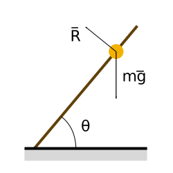

## Introduzione alla meccanica Lagrangiana

La meccanica Lagrangiana è una formulazione matemetica della meccanica
di Newton che fa uso di coordinate generalizzate.
È utile per esempio per lo studio di sistemi in cui sono presenti vincoli.
Inoltre spiega, attraverso il teorema di Noether, la conservazione di
quantità di moto, energia e momento angolare.

La meccanica Lagrangiana (che si chiama così in onore del suo fondatore
Joseph Louis Lagrange) è stato il punto di partenza per lo sviluppo della
meccanica Hamiltoniana, la cui estensione viene poi usata per descrivere
la meccanica quantistica.

Purtroppo il formalismo matematico di queste teorie è un po' pesante e,
secondo me, offusca un poco lo scopo della teoria. Tenterò di rendere
tutto il più semplice possibile.

### Coordinate e vincoli

Quando si descrive un sistema fisico con la seconda legge di Newton:

$$ \frac{d\vec{p}}{dt} = \vec{F} $$

è necessario specificare tutte le forze agenti su ogni elemento del
sistema. In seguito, risolvendo le equazione differenziali (la seconda
legge di Newton è vettoriale, quindi corrisponde ad un sistema di equazioni)
che ne risultano, è possibile calcolare il moto del sistema.

Sorge però un problema quando si ha a che fare con sistemi vincolati:
spesso non si è a conoscenza dei valori delle reazioni vincolari,
che diventano quindi delle incognite, rendendo non risolvibile
l'equazione del moto.

Con il formalismo Lagrangiano si risolve questo problema (quando
i vincoli sono ideali) utilizzando le coordinate generalizzate.
In pratica, anche se la reazione vincolare incognita è un ulteriore
variabile, il vincolo riduce i gradi di libertà del sistema,
eliminando una coordinata necessaria ad esplicitare lo stato del sistema.
Questi due effetti si compensano, ammesso che si usi un opportuno
sistema di coordinate.

> 
>
> __Esempio:__ Una pallina forata è inserita in un asta di legno.
> L'asta è mantenuta obliqua rispetto al pavimento. Vogliamo calcolare
> il moto della pallina, che è soggetta alla forza di gravità. Non siamo
> a conoscenza della reazione vincolare \\( \vec{R} \\) che l'asta esercita
> sulla pallina,
> tuttavia sappiamo che la pallina è costretta a muoversi lungo l'asta,
> per cui ha un solo grado di libertà. Scomponendo le forze lungo l'asta
> e ignorando le componenti perpendicolari all'asta stessa si ottiene 
> un equazione facilmente risolvibile.
>
> Notare che tutto questo è possibile se tra asta e palline non esiste
> attrito, poichè in questo caso la reazione vincolare è perpendicolare
> all'asta e viene quindi eliminata proiettando le forze lungo la direzione
> del moto. Quella che si ottiene è una cosiddetta __equazione di puro moto__
> poiché non sono presenti vincoli.
>
> Se ci fosse stata anche una forza di attrito sarebbe stato necessario conoscere
> la sua forma esplicita per risolvere il problema, poichè il vincolo non era ideale.
>
> Adottando un sistema di coordinate lungo l'asta è quindi possibile risolvere
> il problema in maniera semplice. Questa tecnica è molto utilizzata anche nella
> normale meccanica Newtoniana.

L'esempio sopra è molto calzante. Il formalismo Lagrangiano sostituisce la legge
di Newton con le equazioni di Eulero-Lagrange, che in pratica è la legge di Newton
con le forze scomposte lungo i vincoli, con le coordinate cartesiane sostutuite a
generiche coordinate lungo i vincoli e con l'energia cinetica che prende il posto
dell'accelerazione.

Questo approccio ha dei vantaggi:

 * Le equazioni sono già equazioni di puro moto.
 * In problema dei vincoli è risolto automaticamente. 

### Note sulle coordinate generalizzate

Poichè è possibile prendere come coordinata generalizzata che descrive il
moto una qualsiasi coordinata adatta allo scopo (per esempio un angolo,
se sto tentando di risolvere l'equazione del pendolo), le unità di misura
non tornano più. In parole povere è possibile avere coordinate che non
si misurano in metri, velocità non in m/s e energia cinetica in Kg/s.
Insomma non si può più fare affidamento alle unità di misura per verificare
se il risultato è corretto.
