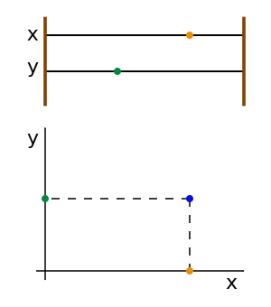

## Vincoli olonomi e spazio delle configurazioni

### Spaziotempo

Il teatro di ogni evento fisico è lo spaziotempo, che indicherò con
\\( \mathbb{V}^4 \\). Ogni elemento dello spaziotempo si chiama __evento__
(ed è come un punto quadridimensionale, per fissare le idee si può pensare
a (t, x, y, z), anche se le coordinate implicano l'esistenza di un sistema
di riferimento, cosa che non è necessaria per definire il concetto di spaziotempo).
Lo spaziotempo non è altro che una varietà differenziabile quadridimensionale,
cioè \\( \mathbb{R}^4 \\), con in più il fatto che esso è __fibrato__.

Fibrato significa che esiste una funzione \\( t: \mathbb{V}^4 \mapsto \mathbb{R} \\),
detta __tempo assoluto__, che associa ogni evento con il tempo corrispondente.
Questa applicazione crea delle fibre \\( \Sigma\_t := \\{p \in
\mathbb{V}^4 |\; t(p) = t\\} \\), dette anche __spazio assoluto al tempo t__ oppure
__spazio di simultaneità al tempo t__. 
I \\( \Sigma\_t \\) sono spazi affini euclidei tridimensionali (cioè normali spazi
3D), che sono anche questi varietà differenziabili. 

> __Esempio:__ Per capire più intuitivamente questi concetti, è utile pensare in
> 2 dimensioni invece che 3. Si può quindi immaginare lo spaziotempo come ad
> una pagnotta a forma di parallelepipedo, in cui ogni fetta è una fibra \\(
> \Sigma\_t \\), cioè lo spazio al tempo t.
> Ogni istante successivo è rappresentato dalle fette di pane successive.

Se consideriamo un punto materiale P che si muove nello spazio, la sua "vita"
in istanti successivi forma una curva P(t) nello spaziotempo, che viene chiamata
__storia__ o __linea di universo__.

> __Nota:__ \\( \mathbb{V}^4 \\) non è uno spazio affine, cioè non è possibile
> calcolare la distanza di due eventi a tempi diversi. Non esistono collegamenti
> tra gli spazi \\( \Sigma\_t \\), almeno finchè non si introduca il concetto di
> sistema di riferimento. Non si possono associare punti a tempi diversi e quindi
> anche il concetto di derivata non è definito.

Lo spaziotempo che ho descritto è conforme alla visione classica, e in particolare
la simultaneità e indipendente dall'osservatore.

### Sistema di riferimento

Finora non ho parlato di sistema di riferimento. Un sistema di riferimento è
una terna ortonormale orientata secondo la regola della mano destra (per convenzione),
che viene assegnata ad ogni spazio di simultaneità \\( \Sigma\_t \\).
In parole più semplici, per definire un riferimento è necessario scegliere
una terna cartesiana per ogni istante di tempo.

In questo modo si possono associare eventi in istanti temporali diversi e
dire, per esempio, se un punto materiale si è mosso da un istante all'altro.

È inoltre necessario fissare l'istante t = 0. In questo modo il sistema di riferimento
è specificato completamente specificato.

#### Derivate

Inoltre un sistema di riferimento permette di definire il concetto di derivata;
è sufficiente specificare che, se indichiamo con \\( \hat{x}, \hat{y}, \hat{z} \\)
i versori della nostra terna ortonormale, vale

$$ \frac{d}{dt} \hat{x} = 0 \qquad \frac{d}{dt} \hat{y} = 0
\qquad \frac{d}{dt} \hat{z} = 0 $$

Le derivate sono rispetto al sistema di riferimento in esame (sarebbe opportuno,
anche se noioso, scrivere \\( \left. \frac{d}{dt} \right|\_\mathcal{I} \hat{x} = 0 \\)
dove \\( \mathcal{I} \\) indica il sistema di riferimento. Io lo indicherò solo quando
ci saranno in gioco più sistemi di riferimento).

In questo modo, conoscendo la definizione di derivata di funzione scalare,
si possono scrivere i vettori in componenti moltiplicate per versori e
derivare solo le componenti, poiché i versori rimangono uguali.
Riassemblando il vettore dopo l'operazione si ottiene il vettore derivata.

### Spaziotempo delle configurazioni

Lo spaziotempo \\( \mathbb{V}^4 \\) è una rappresentazione "intuitiva" dello
spazio come lo vediamo. Un sistema meccanico è rappresentato nello
spaziotempo da un insieme di linee di universo dei punti materiali che lo
compongono. Queste linee di universo specificano come
si evolve il sistema nel tempo.

In alcune branche della fisica e della matematica è utile usare una rappresentazione
alternativa, detta __spaziotempo delle configurazioni__. Se il sistema è
composto da N punti, lo spaziotempo delle configurazioni è uno spazio
\\( \mathbb{V}^{3N + 1} := \mathbb{R}^{3N + 1} \\) in cui il sistema è
rappresentato da una singola linea di universo. Questo spazio è fibrato, cioè
per ogni istante t esiste uno spazio \\( \Sigma^N\_t := \Sigma\_t \times
\dots \times \Sigma\_t \in \mathbb{V}^{3N + 1} \\) i cui punti sono le
possibili configurazioni del sistema al tempo t.

Mentre negli spazi \\( \Sigma\_t \\) il sistema sarebbe descritto da un insieme
\\( \\{(x\_1, y\_1, z\_1), ..., (x\_N, y\_N, z\_N)\\} \\), nello spazio
\\( \Sigma^N\_t \\),
esso è descritto da un solo punto \\( (x\_1, y\_1, z\_1, ..., x\_N, y\_N, z\_N) \\).
In pratica si mettono assieme tutte le coordinate del sistema, nulla di complicato!

> 
> __Esempio:__ Prendiamo un sistema formato da due oggetti (punti materiali).
> Per visualizzare l'esempio supponiamo che questi oggetti si muovano in uno spazio
> unidimensionale. Per esempio si possono considerare due palline su di un
> pallottoliere, che possono muoversi solo lungo le rispettive aste.
> 
> La figura a lato mostra, nel riquadro superiore, il pallottoliere, mentre nel
> riquadro inferiore è mostrato lo spazio \\( \Sigma^N\_t \\). Il solo punto blu
> nel grafico è sufficiente a specificare la posizione di entrambe le palline nel
> pallottoliere. Se chiamiamo x e y ripettivamente le coordinate delle palline
> arancione e verde, basta proiettare il punto che rappresenta il sistema (blu)
> sugli assi per ottenere le coordinate x e y delle palline.

### Vincoli

Un sistema fisico può essere sottoposto a vincoli, cioè a restrizioni a priori
sull'evoluzione del sistema. I vincoli sono descritti da equazioni che limitano o
legano tra di loro le coordinate. Esistono due tipi principali di vincoli:

 * __Vincoli geometrici (sulle configurazioni)__. Sono restrizioni sulla posizione
   che i punti materiali che costituiscono il sistema possono assumere.
   Vincoli geometrici possono essere, per esempio:
    
    * __Superfici o curve__ su cui i punti materiali sono costretti a muoversi.
      Le superfici o curve possono essere anche funzioni del tempo.
    * __Vincolo di rigidità.__ Restringe le posizioni reciproche che due o più
      Punti materiali possono assumere. Un'asta rigida che collega due palline
      e le costringe a stare ad una distanza fissata tra loro è il caso più classico.
      Un altro caso importante è un corpo rigido, dove i punti sono vincolati a
      stare ad una distanza fissa tra loro. Possono esistere vincoli di rigidità
      in cui le distanze reciproche variano nel tempo con una funzione nota a priori.

 * __Vincoli cinetici (sugli stati cinetici)__. Impongono restrizioni sulle
   velocità che i punti materiali del sistema possono assumere. Le equazioni
   di questi vincoli contengono un qualche tipo di velocità. Esempi:
   
    * __Vincoli di Rotolamento__. Il caso più importante sono i vincoli di rotolamento.
      Un disco che rotola su un piano senza scivolare non può avere una velocità
      ed una velocità angolare qualsiasi, poichè esse sono legate tra di loro dal
      rotolamento. Si noti che questo non pone vincoli sulle configurazioni, poiché
      è sempre possibile raggiungere un dato punto del piano con un angolo arbitrario
      di rotazione del disco, facendo percorrere al disco una traiettoria leggermente
      diversa.

#### Vincoli olonomi

Il formalismo Lagrangiano sistema automaticamente i vincoli geometrici.

Supponiamo di avere un sistema di N punti materiali e con \\(\ell\\) vincoli
di tipo geometrico. Nello spazio delle configurazioni i vincoli vengono
generalmente posti da equazioni del tipo 

$$ f\_p(t, x\_1, \dots, x\_{3N}) = 0
\qquad \text{con} \quad p \in \\{1, \dots, \ell\\}$$

dove ho indicato le coordinate con \\(x\_1, x\_2, x\_3, \dots\\) al posto di
\\(x\_1, y\_1, z\_1, \dots\\) per comodità notazionale (vedi sotto) e perché
in questo modo si evita di far riferimento ad un sistema di riferimento cartesiano,
rimanendo più generali.

Un espressione di questo tipo lega tra di loro le coordinate, eliminando un grado
di libertà. I gradi di libertà del sistema sono quindi \\(n = 3N - \ell \\).
Vincoli di questo tipo si dicono __vincoli olonomi__ se sono tra loro
__funzionalmente indipendenti__, ovvero se

$$ \text{rango} \left[\left( \frac{\partial f\_p}{\partial x\_i}
\right)\_{p = 1, \dots, \ell,\; i = 1, \dots, 3N}\right] = \ell $$

A parole: le righe della matrice indicata sopra, che non sono altro
che i gradienti delle funzioni \\(f\_p\\), devono essere linearmente indipendenti
in ogni punto dello spaziotempo. In pratica questa condizione ci assicura che
i vincoli tolgano ogniuno un grado di libertà. Se due vincoli in qualche punto
imponessero la stessa condizione, allora sarebbero linearmente indipendenti in quel
punto, facendo si che il rango della matrice diventi minore di \\( \ell \\).

> __Esempio:__ Consideriamo un punto materiale vincolato da \\( f\_1, f\_2\\).
> Supponiamo che entrambe le condizioni impongano al punto di rimanere su un piano
> specificato. Se i due piani sono diversi tra loro, ognuna delle condizioni toglie
> un grado di libertà (\\(n = 3N - \ell = 3 - 2 = 1\\)). Quindi il punto sarà
> costretto a muoversi sulla retta di intersezione tra i piani.
>
> Se le condizioni \\( f\_1, f\_2\\) imponessero al punto di rimanere sullo stesso
> piano, ovvero fossero la stessa condizione, allora il calcolo dei gradi di libertà
> come eseguito sopra non funzionerebbe più perché i vincoli non sarebbero più
> indipendenti (il loro gradiente sarebbe uguale).

Notare come i matematici siano perversi quando danno i nomi... Vincoli olonomi
suona da chissà cosa, mentre in realtà sono soltanto un insieme di vincoli che abbia
senso!

### Spaziotempo delle configurazioni in presenza di vincoli

Ora, consideriamo nuovamente il nostro sistema di N punti materiali con
\\(\ell\\) vincoli olonomi. Poichè i vincoli legano tra di loro le variabili,
attraverso le equazioni dei vincoli è possibile esplicitare alcune coordinate
in termini delle altre.
Nello spazio tridimensionale sono necessarie 3N coordinate per descrivere lo
stato del sistema. Avendo \\( \ell \\) equazioni

$$
f\_p(t, x\_1, \dots, x\_{3N}) = 0
\qquad \text{con} \quad p \in \{1, \dots, \ell\}
$$

possiamo invertire queste relazioni e scrivere

$$
x\_1 = x\_1(x\_{\ell+1}, \dots, x\_{3N}), \quad
\dots, \quad
x\_\ell = x\_\ell(x\_{\ell+1}, \dots, x\_{3N}) \\
$$

per cui bastano solo le coordinate \\( x\_{\ell+1\}, \dots, x\_{3N}\\) per
esplicitare lo stato del sistema. Questo ragionamento vale anche se scegliamo
delle coordinate non cartesiane. In pratica è sempre necessario un numero di
coordinate pari al numero di gradi di libertà del sistema.

> __Esempio:__ Un punto costretto a muoversi su di una circonferenza ha un solo
> grado di libertà. Basta una sola variabile per descrivere il punto, per
> esempio un angolo. Su di una sfera sono invece necessarie due coordinate
> (per esempio latitudine e longitudine), per descrivere la posizione
> di un punto. Se il sistema fosse composto da due punti sulla superficie di
> una sfera sarebbero necessarie 4 coordinate (coppie di latitudini e longitudini).

A questo punto possiamo introdurre un nuovo spazio (tutti questi spazi sono
anche varità differenziabili), che è un sottoinsieme dello spazio delle configuazioni:
lo __spazio delle configurazioni in presenza di vincoli__ \\(\mathbb{V}^{n + 1} \\)
(dove \\(n = 3N - \ell\\) sono i gradi di libertà). Questo spazio ha come coordinate
n variabili \\( q^\, \dots, q^n \\) che possono per esempio essere quelle
esplicitate nell'ultima formula, ma non devono essere necessariamente cartesiane.
Sono delle coordinate sufficienti a descrivere lo stato del sistema.

#### Vincoli ideali

Un vincolo viene considerato ideale quando il corpo vincolato non è sottoposto ad
attriti. Per esempio un disco vincolato a rimanere su un piano è soggetto ad un
vincolo ideale se tra disco e piano (del tavolo per esempio) non c'è attrito,
anche se il disco non può sollevarsi dal piano.

Un vincolo limita i movimenti un punto materiale mediante una forza detta
__reazione vincolare__ (nell'esempio del tavolo, il tavolo imprime una forza sul disco
che impedisce a quest'ultimo di sprofondare all'interno del piano stesso).
Un vincolo ideale nel senso indicato poco fa (assenza
di attriti) ha la proprietà che la reazione vincolare è sempre perpendicolare alla
superficie del vincolo.

In realtà i vincoli ideali come li definiremo tra poco, sono un concetto più
generale, che comprende per esempio il vincolo di rigidità, dove non ha senso
di perpendicolarità ad una superficie. Tuttavia l'idea di reazione vincolare
perpendicolare al vincolo aiuta a capire il senso del discorso che segue.

Consideriamo un sistema costituito da N punti materiali ed \\( \ell \\) vincoli _olonomi_.
Se indichiamo con \\( \vec{x}\_i \\) il vettore posizione del punto _i_-esimo rispetto
ad un riferimento cartesiano \\( \mathcal{I} \\) e supponiamo che il sistema sia
descritto da n variabili \\( q^\, \dots, q^n \\), allora l'espressione

$$ \frac{\partial \vec{x}\_i}{\partial q^k} $$

è un vettore tangente alla superficie del vincolo (in alcuni casi questo non è vero,
come detto sopra, ma continuerò con l'analogia per rendere semplice la comprensione).

Su ogni punto _i_-esimo del sistema agisce la __forza attiva__ \\( \vec{F}\_i \\),
cioè la forza totale esclusa la reazione vincolare (questa forza può anche dipendere dal
sistema di riferimento, cioè includere forze inerziali), e la reazione vinolare
\\( \vec{R}\_i \\). Si chiama __componente lagrangiana delle forze attive lungo__
\\( q^k \\) la quantità

$$ Q\_k = \sum\_{i=1}^N F\_i \cdot \frac{\partial \vec{x}\_i}{\partial q^k} $$

che non è altro che la proiezione lungo la coordinata in esame (\\(q^k\\)) di tutte
le forze attive.

Nel caso di un insieme di vincoli olonomi ideali si avrà quindi che la componente
lagrangiana delle _reazioni vincolari_ lungo ogni coordinata è nulla, cioè

$$ \sum\_{i=1}^N R\_i \cdot \frac{\partial \vec{x}\_i}{\partial q^k} = 0
\qquad \forall k \in \\{1, \dots, n\\} $$

Queste relazioni implicano la seguente:

$$ \sum\_{k=1}^n \sum\_{i=1}^N R\_i \cdot \frac{\partial \vec{x}\_i}{\partial q^k} = 0 $$

ma non è vero il contrario (ovvero quest'ultima è più generale, vale per i vincoli
senza attrito, ma non solo). I vincoli che rispettano questa formula sono detti
__vincoli ideali__.
